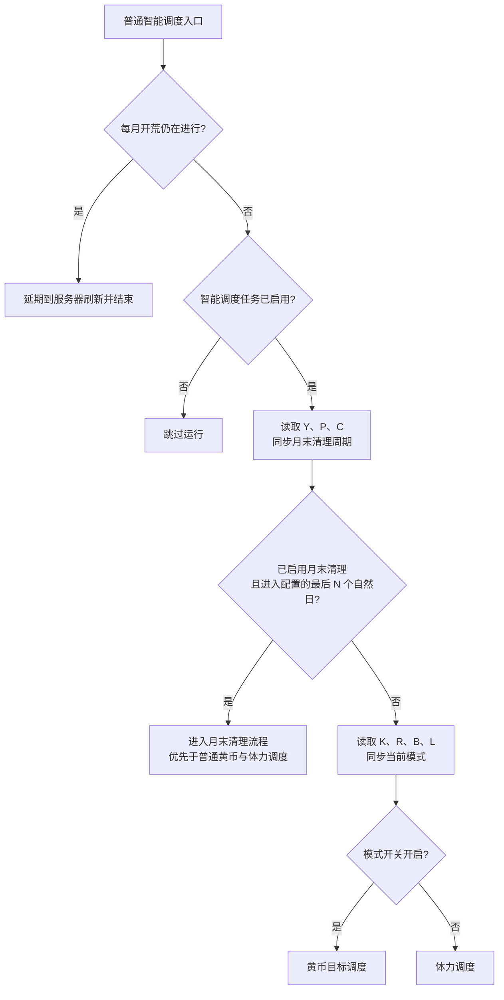
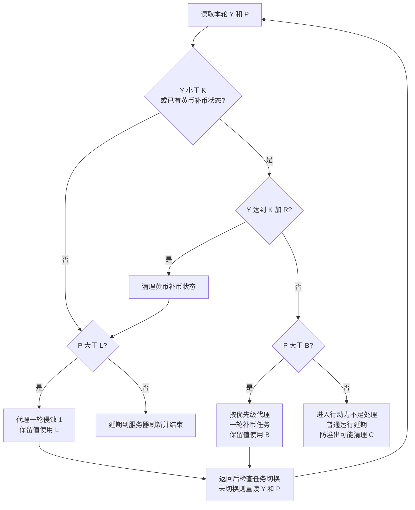
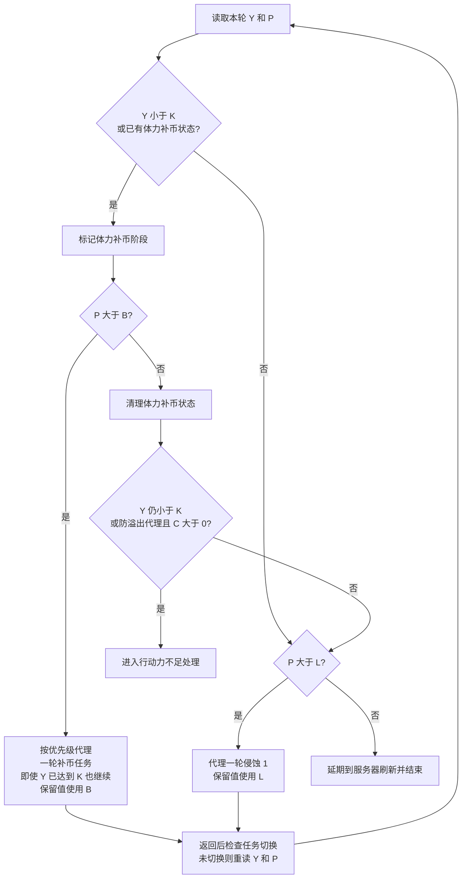
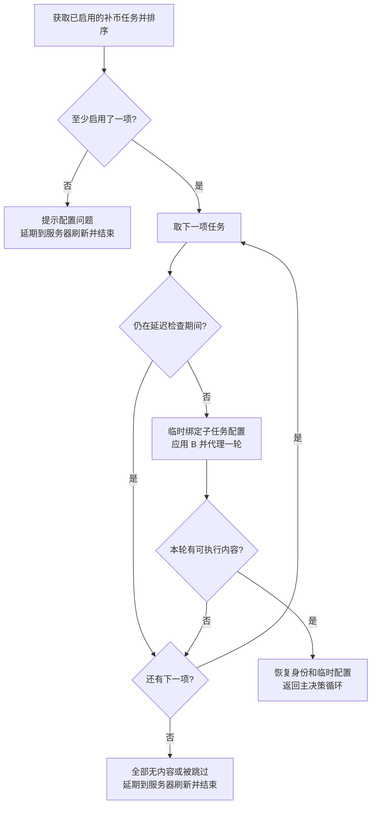
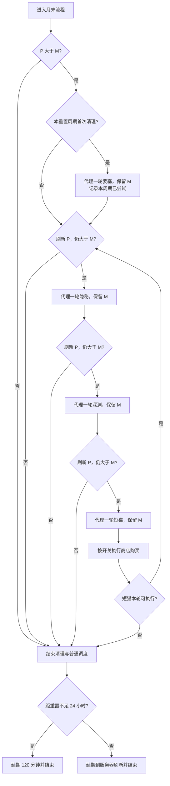
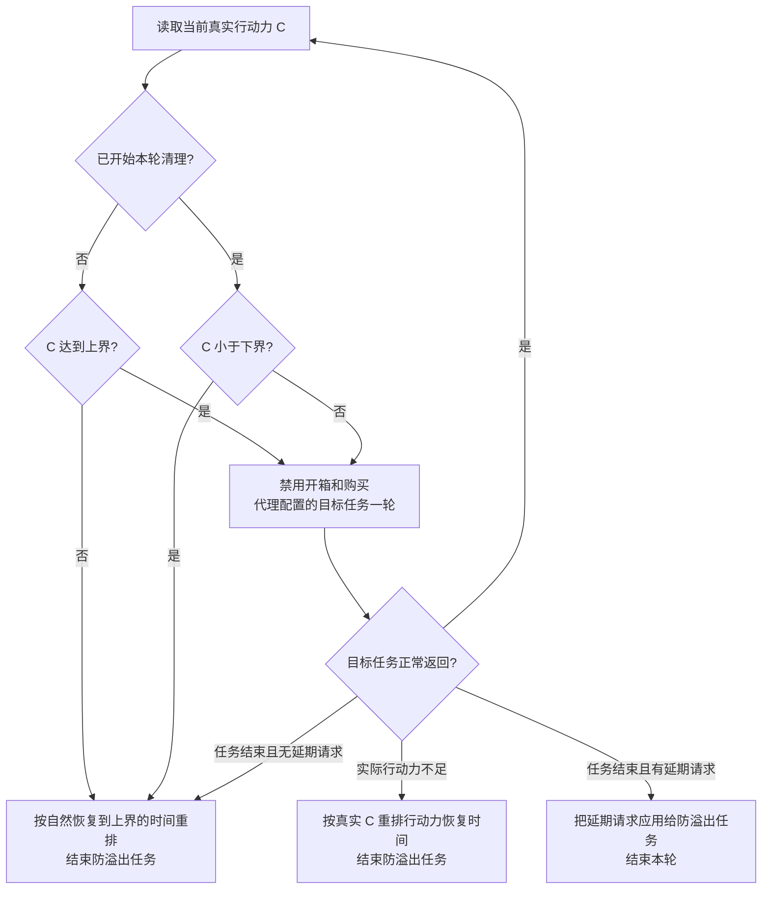

# 大世界智能调度+流程图

本图依据当前 `module/os/tasks/scheduling.py`、`prevent_action_point_overflow.py` 和 `task_context.py` 的实际实现。用于核对现有行为与预期；数值示例是演示值，不读取真实账号配置。

## 1. 保留值与符号

| 符号 | 含义 | 实际配置来源 |
| --- | --- | --- |
| Y | 当前黄币 | 游戏画面识别结果 |
| P | 本轮可用于决策的总行动力 | 开箱开启时包含箱内行动力；开箱关闭时只含当前行动力 |
| C | 当前真实行动力 | 不包含箱内行动力 |
| K | 黄币保留值，两种模式共用 | `OpsiScheduling.OpsiScheduling.OperationCoinsPreserve` |
| R | 黄币回补增量，仅黄币目标模式使用 | `OpsiScheduling.OpsiScheduling.OperationCoinsReturnThreshold`，无效或负值按 0 处理 |
| B | 补黄币行动力保留线 | 优先使用 `OpsiScheduling.OpsiScheduling.ActionPointPreserve` 的正值；该值为 0 时回退到耄耋相接自身的 `ActionPointPreserve`，后者显式 0 有效，缺失默认 1000 |
| L | 侵蚀 1 行动力保留线 | `OpsiHazard1Leveling.OpsiHazard1Leveling.MinimumActionPointReserve`，缺失默认 200 |
| M | 月末清理行动力保留线 | `max(月末保留配置, 跨月任务启用时的 200)` |

**智能调度的体力模式也读取自己的 K。** K 与侵蚀 1 独立任务的黄币保留配置分别保存。B 用于补黄币任务，L 用于侵蚀 1，M 用于月末清理。

决策 P 与仪表盘总行动力口径不同：仪表盘始终包含箱内行动力。防溢出代理临时禁用开箱和行动力购买，此时决策 P 等于 C。

## 2. 入口与优先级

普通智能调度入口先拦截每月开荒，再检查自身任务开关。防溢出可直接代理单轮智能调度，也有开荒拦截；该代理调用不要求智能调度自身的调度器开关开启。

切换两种模式时清理旧模式的补币状态和通知状态。补币状态保存在智能调度的 `Storage.Storage`，进程重启后仍可继续当前阶段。

## 3. 黄币目标调度

进入补币的条件是 Y 小于 K，或上一轮已经进入补币阶段。进入后，返回侵蚀 1 的目标固定为 **K + R**，与本轮起始黄币无关。起始黄币只是持久化的阶段记录。

未进入补币阶段时，只要 Y 已达到 K，就允许练级，不要求先达到 K + R。补币阶段中途行动力不足时，普通运行延期，保留补币状态，下次继续判断 K + R。

## 4. 体力调度

进入补币的条件同样使用智能调度自己的 K。进入后，**黄币已经达到 K 也不立即返回练级**；补币阶段持续到 P 小于或等于 B。体力模式不使用 R。

当 P 恰好等于 B 时结束补币；当 P 恰好等于 L 时不继续练级。达到 B 后，黄币仍不足的普通智能调度会延期，不强行切回侵蚀 1。

## 5. 补币任务如何选择

普通补币只使用智能调度里启用的子任务，按 `TaskPriority` 排序。未列入优先级文本的启用任务排在已列入任务之后。

- 要塞清空后，检查推迟到下一次周刷新或月重置中较早的时间，再加 2 小时缓冲。
- 隐秘、深渊清空后可按配置推迟若干天，上限为清空后的第一次月重置再加 2 小时缓冲；延迟天数为 0 时每轮都检查。
- 深渊的潜艇冷却可使本轮跳过该任务，继续尝试其他任务。
- 每次只代理一轮有内容的任务，再回主循环重新判断资源。优先级靠前的任务可能连续被选中，并非轮询平均分配。
- 不因代理执行而启用或关闭子任务的独立调度开关。既有任务进度、清空状态与统计按原职责保存。
- 子任务抛出实际 `ActionPointLimit` 时，普通主决策延期到服务器刷新；短猫达到本轮正数保留值时可正常返回主决策。
- 要塞所有可用舰队均失败时请求人工接管；设备卡死、重复点击等异常正常交给上层恢复。

## 6. 月末清理

触发需同时满足：清理开关开启、配置天数大于 0、距离下一次大世界重置的剩余自然天数不超过配置值。M 在启用跨月任务时至少为 200。

**当前月末流程固定尝试要塞、隐秘、深渊、短猫，不受普通补币的独立启用开关、优先级和延迟检查记录限制。** 要塞每个重置周期只在首次清理时尝试一轮；隐秘、深渊、短猫每轮按固定顺序尝试。商店是否购买由月末商店开关控制。

图中的“距重置不足 24 小时”对应代码的整天数 `get_os_reset_remain() <= 0`；进入月末窗口则使用自然天数，两种时间口径要区分。达到 M 后不会转去普通侵蚀 1 消耗预留行动力。子任务行动力不足可结束该子步骤；商店的任务结束和恢复异常正常上抛。

## 7. 防溢出代理的特殊行为

防溢出根据当前真实行动力 C 触发，不能把仪表盘包含箱子的总行动力拿来与上下界比较。

- 目标可以是智能调度、侵蚀 1、耄耋相接。直接代理后两者时传入防溢出下界；代理智能调度时先走智能调度自身的决策。
- 智能调度处于补币分支但 P 未超过 B、且 C 大于 0 时，可改为代理一轮短猫，保留值传 0，用于消耗自然行动力；这条路径不受普通补币独立启用开关限制。
- 若该短猫无内容，延期到服务器刷新；若实际行动力不够进入海域，由防溢出外层按真实 C 重排。
- 仅黄币充足且正常走侵蚀 1 分支时，P 达到 L 会延期，不会自动进入上述短猫兜底。
- 嵌套代理保持最外层任务身份用于任务切换判断，退出后恢复子任务的临时强制配置。真正出现更高优先级任务时仍可以切换。

## 8. 用数值核对预期

假设 K = 40000、R = 20000、B = 1000、L = 200；未进入月末窗口，普通运行，补币任务有内容。

| 场景 | 黄币目标模式 | 体力模式 |
| --- | --- | --- |
| 未在补币阶段，Y = 50000，P = 3000 | 直接练级，不要求先到 60000 | 直接练级 |
| Y = 30000，P = 3000 | 进入补币，目标 60000 | 进入补币，目标是把 P 消耗到 1000 |
| 已在补币阶段，Y = 50000，P = 2000 | 继续补币，尚未达到 60000 | 继续补币，尚未达到行动力保留线 |
| 已在补币阶段，Y = 65000，P = 2000 | 清理补币状态，恢复练级 | 继续补币，黄币变多不提前结束 |
| 已在补币阶段，Y = 50000，P = 1000 | 尚未达到 60000 且行动力不足，延期 | 清理补币状态，黄币已达 40000 且 P 大于 L，恢复练级 |
| Y = 30000，P = 1000 | 行动力不足，延期 | 清理体力补币状态，黄币仍不足，延期 |
| Y 已满足练级条件，P = 200 | 延期，不继续练级 | 延期，不继续练级 |

上轮已按“体力调度也读自己的保留值”调整：两种模式读取智能调度自己的黄币保留值。其余关键核对项是：体力补币阶段是否应一直消耗到 B；月末是否应固定尝试全部四类补币任务；防溢出是否允许用未在普通补币中启用的短猫兜底。

行动力保留按任务边界检查，单次海域消耗可能跨过保留线；本图没有把保留值画成逐点扣费前的硬底线。

## 9. 代码与验证入口

- 主决策与模式：`OpsiScheduling.run_smart_scheduling_once()`。
- 补币选择：`OpsiScheduling._dispatch_coin_task()`。
- 月末清理：`OpsiScheduling._run_month_end_cleanup()`。
- 防溢出：`OpsiPreventActionPointOverflow.run_prevent_action_point_overflow()`。
- 代理身份和强制覆盖恢复：`opsi_task_context()`。
- 离线回归：`tests/test_opsi_scheduling_modes.py`、`test_opsi_month_end_cleanup.py`、`test_opsi_coin_task_preserve.py`、`test_opsi_task_context.py`、`test_opsi_stronghold_outcome.py`。
